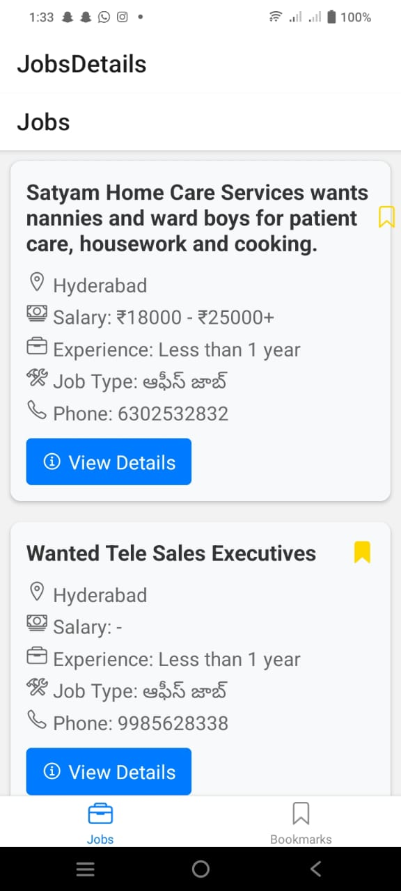
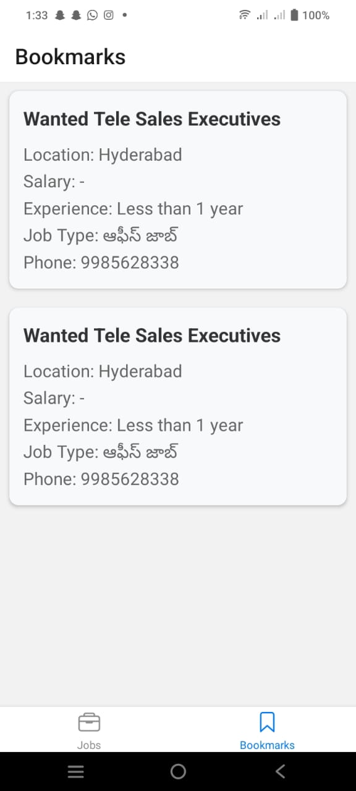
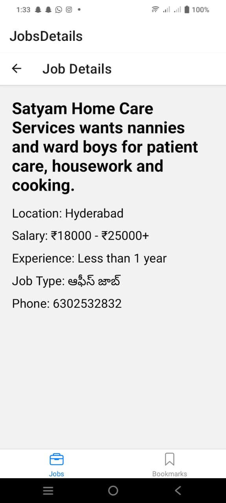

---

# JobFinder

A React Native application that helps professionals discover and track job opportunities with ease.

## Features

- **Smart Job Search**: Advanced filtering and search capabilities
- **Job Bookmarking**: Save interesting positions for later review
- **Detailed Views**: Comprehensive job information at your fingertips
- **Offline Access**: View saved jobs without internet connection

## Project Structure

```
jobfinder/
├── api/
│   └── api.js                # API functions for fetching jobs
├── screens/
│   ├── BookmarksScreen.js    # Screen displaying saved jobs
│   ├── JobDetailScreen.js    # Screen displaying details of a single job
│   └── JobsScreen.js         # Main screen displaying job listings
├── components/
│   ├── BookmarkManager.js    # Functions for managing saves (save, remove, get)
│   └── AppNavigator.js       # App navigation setup
├── App.js                    # Main entry point of the app
├── package.json              # Project metadata and dependencies
└── README.md                 # Project documentation
```

## Installation
```bash
npm install -g expo-cli
expo init JobFinder
cd JobFinder
```

## Mobile Application Screens

### Screen 1: Job Discovery Screen

- **Description**: Browse through available positions with easy-to-use search and filter options.

  

### Screen 2: Saved Jobs Screen

- **Description**: Access your curated collection of saved opportunities.

  

### Screen 3: Job Detail Screen

- **Description**: Get comprehensive information about specific positions.

  

## Video Presentation
You can watch live application here: [Job Search Application](https://drive.google.com/file/d/129NROcij9H1hh8nuoJL0vZe27rqUFXow/view?usp=sharing)

## Technical Requirements

- Bottom navigation bar
- API integration with pagination
- Local storage implementation
- Error handling
- Loading states
- Offline capability

## Development Notes

### Setup
1. Install dependencies
2. Configure environment
3. Run development server

### Common Issues
- Verify dependency installation
- Check storage permissions
- Ensure proper API connectivity

---

